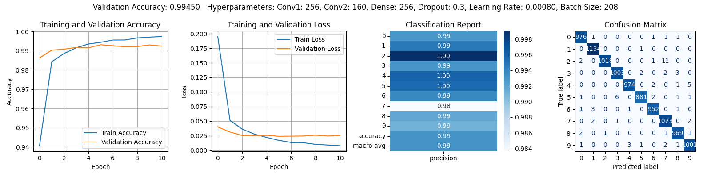
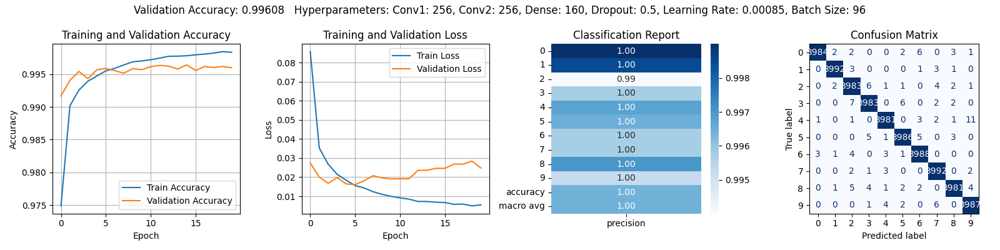
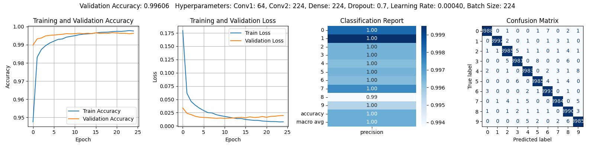
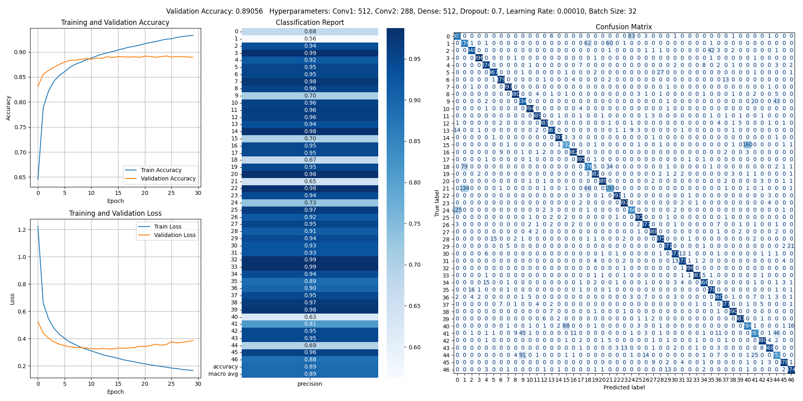
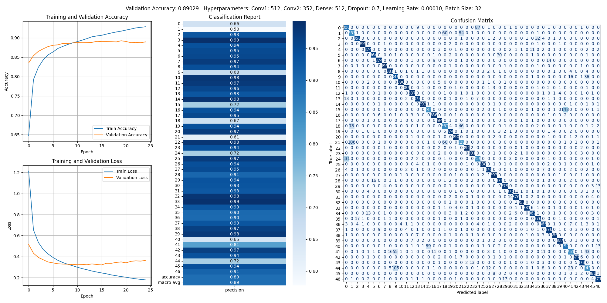

# CS 4375 - Machine Learning Final Project

## Overview

This project is a machine learning project that uses convolutional neural networks (CNNs) to classify handwritten digits and letters.

## Datasets

- The [MNIST](https://www.tensorflow.org/datasets/catalog/mnist) dataset is a collection of 28x28 pixel grayscale images of handwritten digits (10 classes: 0-9). The dataset contains 60,000 training images and 10,000 test images.

- The [EMNIST Digits](https://www.tensorflow.org/datasets/catalog/emnist) dataset is an extension of the MNIST dataset that contains 28x28 pixel grayscale images of handwritten digits (10 classes: 0-9). The dataset contains 240,000 training images and 40,000 test images.

- The [EMNIST Balanced](https://www.tensorflow.org/datasets/catalog/emnist) dataset is an extension of the MNIST dataset that contains 28x28 pixel grayscale images of handwritten digits and letters (47 classes: 0-9, A-Z, a-h, n, q, r, t). The dataset contains 112,800 training images and 18,800 test images.

## Methodology

The project uses the [TensorFlow](https://www.tensorflow.org/) library to train a convolutional neural network (CNN) model. The model has 2 convolutional layers, 2 max pooling layers, and 2 dense layers. The model is trained using the Adam optimizer with the categorical crossentropy loss function. Some of the hyperparameters that were tuned include the learning rate, convolutional layer units, dense layer units, and dropout rate.

Tuning of the hyperparameters was done using the [Keras Tuner](https://keras-team.github.io/keras-tuner/) library's Hyperband tuner. This tuner uses a novel approach of tournament bracket-style resource allocation known as successive halving. Hyperband optimizes hyperparameter tuning by arranging models in several brackets, each containing multiple trials with unique hyperparameter configurations. Initially, a small amount of computational resources (such as training epochs) is allocated to each model in a bracket. Models that perform best after these early training rounds advance to receive additional resources, while weaker models are eliminated from further training. This approach allows Hyperband to explore a large range of hyperparameters quickly and focus resources on the most promising configurations.

## Results

There are three iterations of the model. The first of which was trained on the MNIST digits dataset, the second on the EMNIST Digits dataset, and the third on the EMNIST Balanced (digits and letters) dataset.

### Model 1: MNIST Digits

Below are the results for the 3 best performing models trained on the MNIST digits dataset.

Total trained models: 7361 \
Total training time: ~ 72 hours

##### Best Models

### Model 2: EMNIST Digits

Below are the results for the 3 best performing models trained on the EMNIST Digits dataset.

Total trained models: ~ 3677 \
Total training time: ~ 100 hours

##### Best Models

### Model 3: EMNIST Digits and Letters

Below are the results for the 3 best performing models trained on the EMNIST Balanced dataset.

Total trained models: ~ 6292 \
Total training time: ~ 195 hours

##### Best Models

